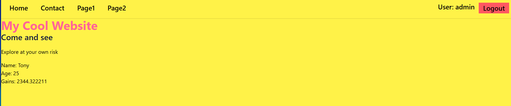
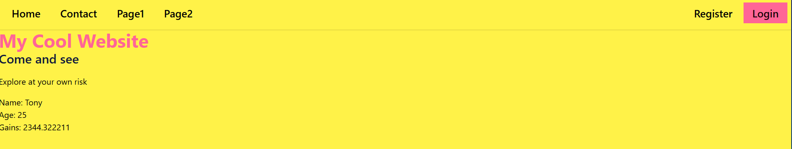
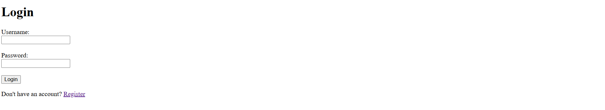
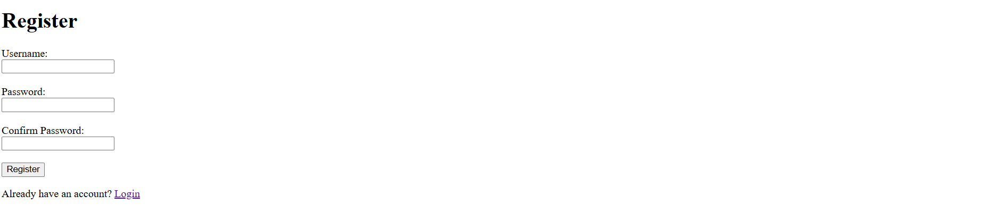

# Django Static Page  With Authentication

Create 4 webpages with templates (4 + 1 base template), for every page use a different DaisyUI theme.

I have upgraded my previous static page templates by adding **Registration** and **Login** functionality. The logic is designed to be simple and seamless:

--------------------------------------------------------
### 1. The Navbar is the "Dashboard"
Instead of creating a separate dashboard page, the **Navbar** (in `base.html`) dynamically changes based on your status:
* **Logged Out State:** Shows the menu + **Register** and **Login** buttons.
* **Logged In State:** The Register/Login buttons disappear. They are replaced by the **Username** and a **Logout** button.
* **Universal Access:** Since all pages inherit from `base.html`, this "Dashboard" logic is visible on every page.

### 2. Selective Access Control
I have added a "Gatekeeper" to protect specific content:
* **Home Page:** Remains public and accessible to everyone.
* **Protected Pages:** **Contact**, **Page 1**, and **Page 2** now require an account. If you click them while logged out, you are automatically redirected to the **Login** page.
##  Screenshots

### Home Page Logged in

### Home Page Logged out

### Login page

### Register page

-----------------------------------------------------------
